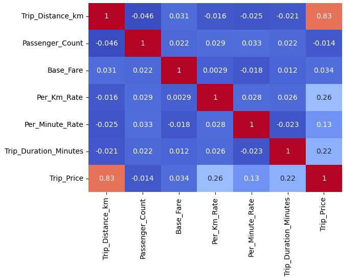
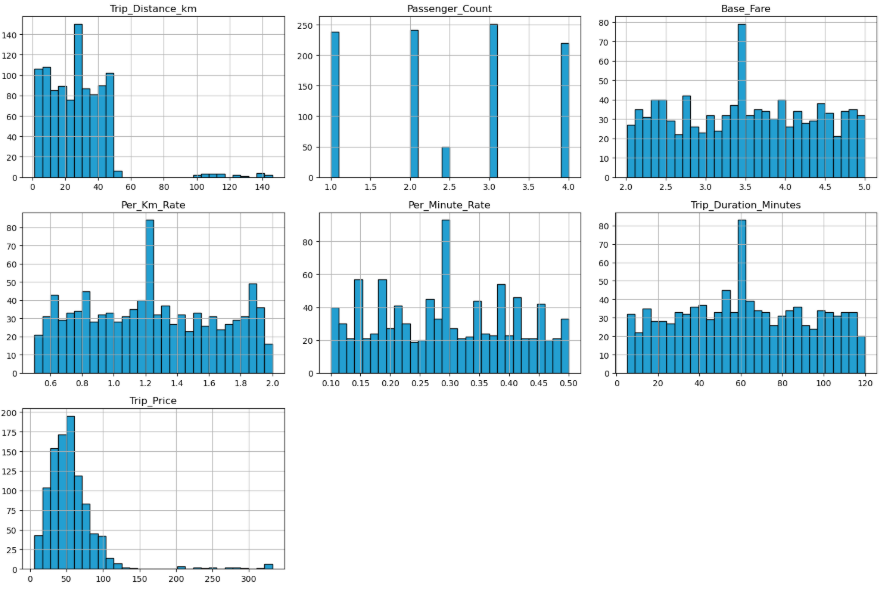
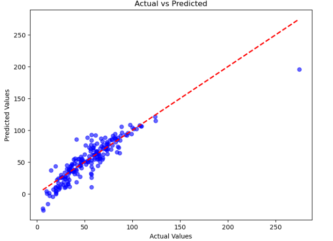

# Taxi Price Prediction

---

## Project Overview
The project aims to accurately estimate taxi trip fares using a Linear Regression model trained on structured trip data. The model leverages multiple trip-related attributes such as distance, duration, traffic conditions, weather, and rate components to predict the **Trip Price**.

---

## Dataset Description

| Column | Description |
|---------|-------------|
| **Trip_Distance_km** | Total trip distance in kilometers. |
| **Time_of_Day** | Categorical feature (e.g., Morning, Afternoon, Evening, Night) representing when the trip occurred. |
| **Day_of_Week** | Indicates whether the trip happened on a weekday or weekend. |
| **Passenger_Count** | Number of passengers during the trip. |
| **Traffic_Conditions** | Traffic intensity level such as Low, Medium, or High. |
| **Weather** | Weather condition during the trip (e.g., Clear, Rain, Snow). |
| **Base_Fare** | Initial fare charged at the start of the trip. |
| **Per_Km_Rate** | Fare rate applied per kilometer traveled. |
| **Per_Minute_Rate** | Fare rate applied per minute of trip duration. |
| **Trip_Duration_Minutes** | Total trip duration in minutes. |
| **Trip_Price** | Target variable representing the total fare. |

---

## Workflow

### 1. Data Visualization
Generated plots:
- **Correlation Matrix** → Feature correlation   
- **Data Visualization** → Exploratory analysis   

### 2. Data Preprocessing
- Load dataset and clean null or invalid entries.
- Encode categorical features
- Scale or normalize continuous variables for model stability.  

### 3. Evaluation
- Train-test split for validation  
- Metrics used:
  - Mean Absolute Error (MAE)  
  - R² Score  
- **Prediction visualization:** comparison between actual vs predicted fares .

---

## Result Summary

### Evaluation Metrics
| Metric | Value |
|--------|-------|
| **Mean Squared Error (MSE)** | 194.72 |
| **R-squared (R²)** | 0.765 |

## Installation

1\. Clone the repository:

    git clone https://github.com/AShr12xz/Taxi-Price-Prediction.git
    cd Taxi-Price-Prediction

2️\. Install dependencies:

    pip install pandas numpy scikit-learn matplotlib seaborn
    
3\. Run the notebook Taxi_Price_Prediction.ipynb

---

## Technologies Used

| Category | Tools / Libraries |
|-----------|-------------------|
| **Programming Language** | Python 3.8+ |
| **Data Handling** | pandas, numpy |
| **Data Visualization** | matplotlib, seaborn |
| **Machine Learning** | scikit-learn |
| **Notebook Environment** | Jupyter Notebook |
